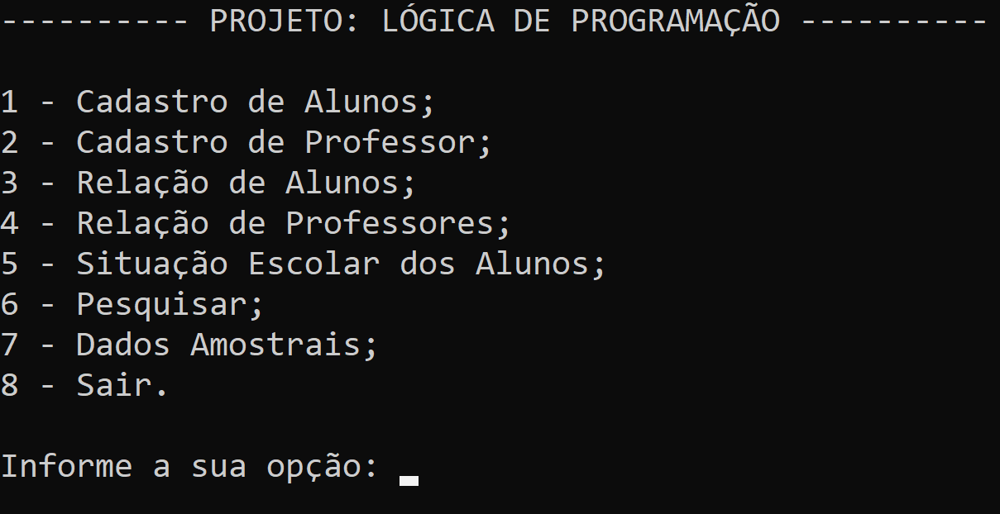

<h1>Sistema de Cadastro</h1>  
Sistema de cadastro, desenvolvido em C e sem banco de dados.  
Projeto criado para desenvolvimento de lógica de programação com C.

##

##

Conceitos abordados:  
- Laços de repetição;
- Estrutura de condição;
- Funções;
- Vetores;
- Struct;
- Biblioteca string;

